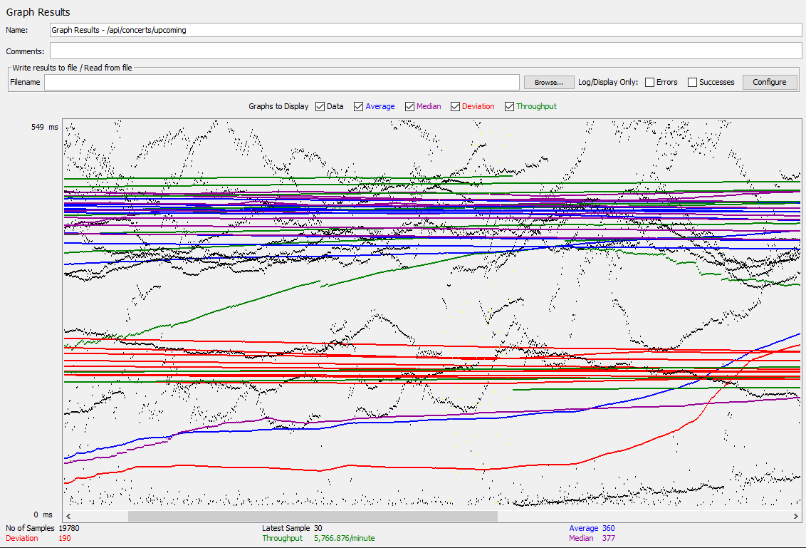
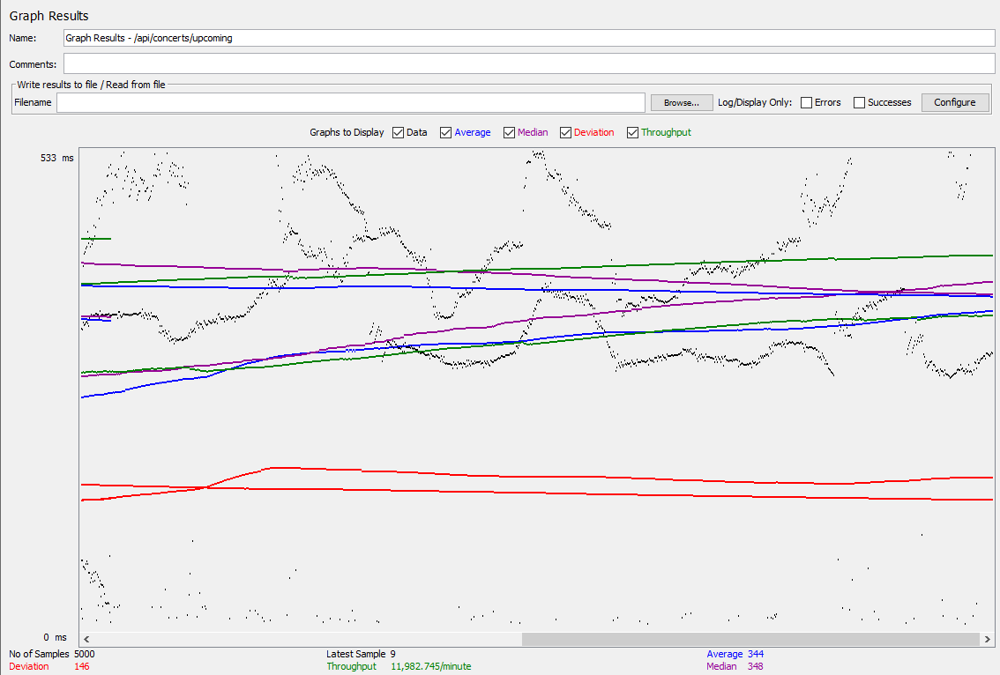

# Load Test

## Load Test before Implement Conncetion Poll


```
Average Response Time: 360 ms.
Median Response Time: 377 ms.
Deviation: 190 ms.
Total Samples: 5,000.
```

## Load Test after Implement Conncetion Poll


```
Average Response Time: 344 ms.
Median Response Time: 348 ms.
Deviation: 146 ms.
Total Samples: 5,000.
```

## Pool Configuration
```
# HikariCP settings
spring.datasource.hikari.minimum-idle=5
spring.datasource.hikari.maximum-pool-size=20
spring.datasource.hikari.idle-timeout=30000
spring.datasource.hikari.connection-timeout=20000
spring.datasource.hikari.max-lifetime=1800000
```